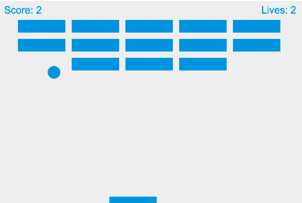

# 2D-Breakout
 
This is a simple 2D Breaking Brick Game.

There is a moving ball, a base, and collection of bricks.
User have to move the base to bounce back the ball to break the brick, if failed user Lose life & if all bricks are brocken User Wins.
users score and remaining lifes are displayed on top.

This is designed using HTML, CSS and JAVA SCRIPT.
